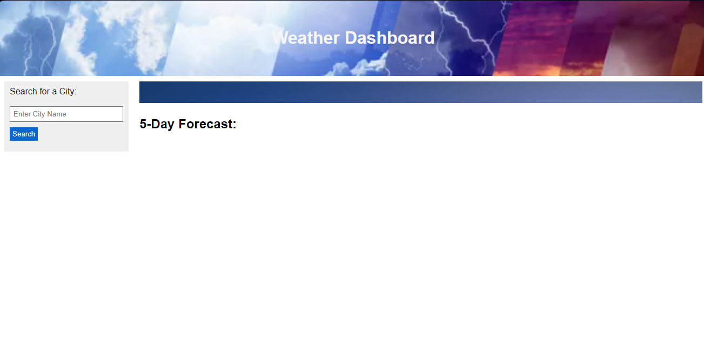
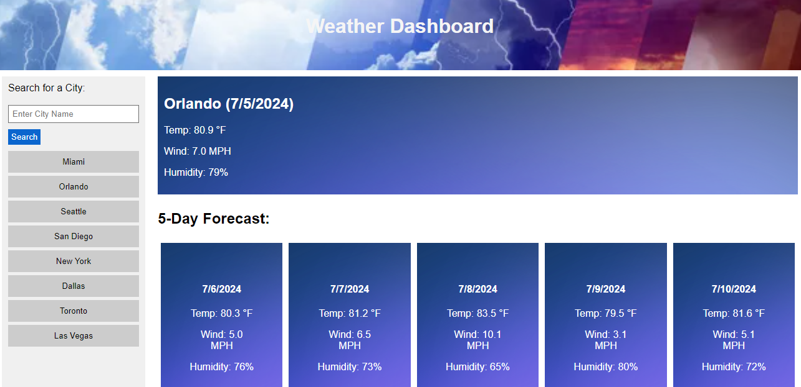
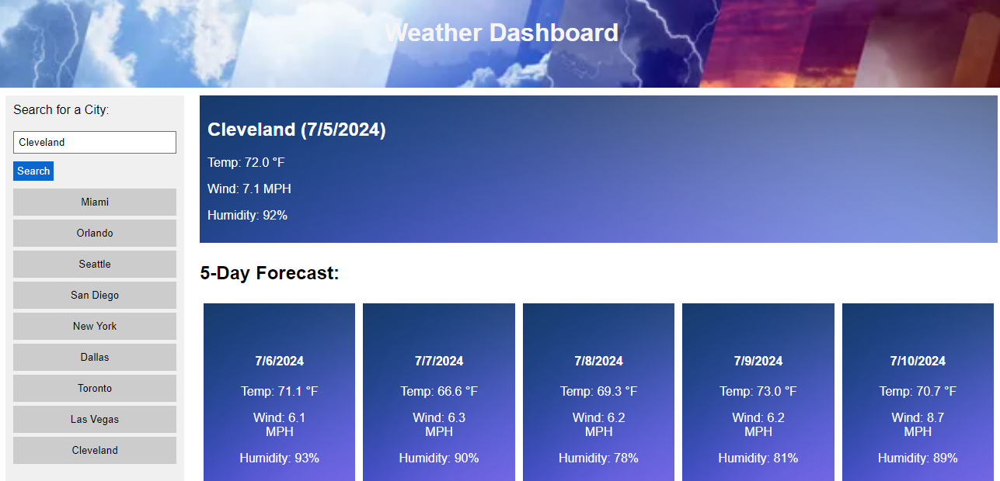

# WeatherAppChallenge6

# Introduction:
A simple, yet effective weather app to provide today's and the following 5 days forecast. The App makes use of the Open Weather Map API, and is programmed using HTML, CSS and JavaScript.

# App Uses:
The website provides you with the following information upon the city/cities search for.
Today and the next 5 days:
* Temperature
* Wind Speed
* Humidity

# Installation
not installatiion required, works directly on the website link.

# How to use:
In the box that says "Enter City Name" enter the name of a city, you can select just about any city in the world.

Press the Search button.

And that's it. your weather forecast will now be shown.

After each search, a history of previous searches will appear underneath the Search button area. You can click them to immediately return to the selected city.

# Links
Git Hub Repository Link.
https://github.com/ConnorLuks/WeatherAppChallenge6

Git Pages Link.

# Screenshots of the website:
Displays the page upon loading the website.

Shows several results, along with result from clicking a previously searched city.

Shows additional results.

# License:
Distributed under the MIT license.

# Credits:
Connor O'Halloran.
Open Weather Map API for the API needed.